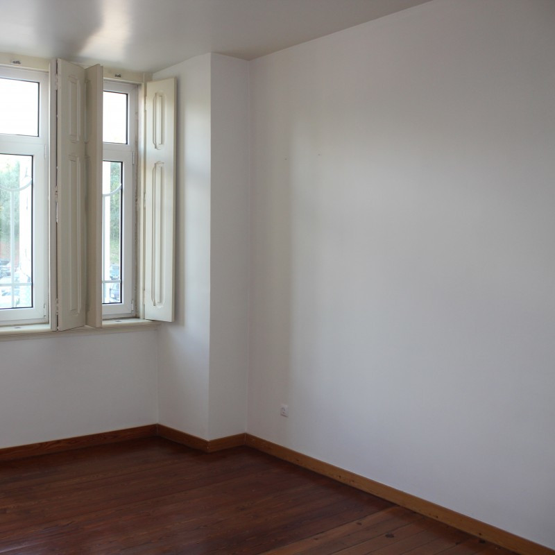
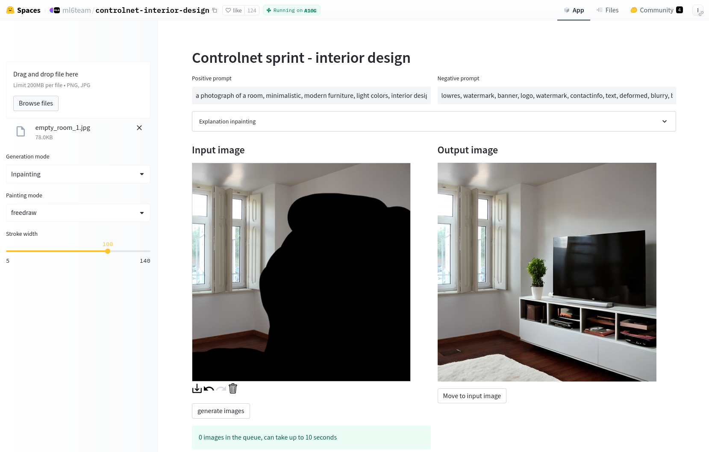
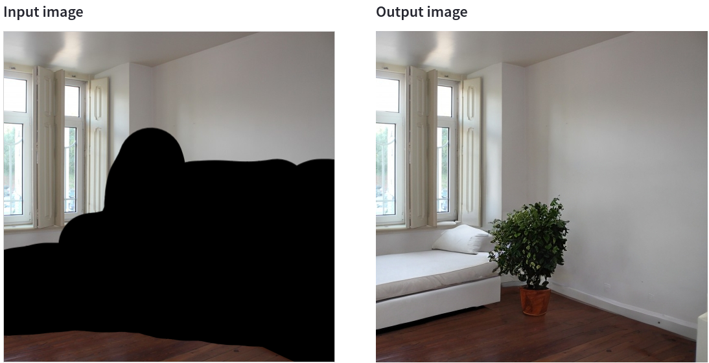

# Room Inpainting: Add furniture to pictures of empty flats

## Backstory

A friend of mine wants to **put up a flat for rent online** but the **pictures are missing furniture**. I was asked if it is possible to place furniture in the photos using Artificial Intelligence. After some research I found a demo that can do this using *Stable Diffusion* and *Control net* in an **inpainting** mode.




The demo runs on the web browser in a docker container using a GPU.

## Instructions




1. Upload an image.
2. Choose inpainting mode
3. Mask the area to place furniture.
4. Describe a piece of furniture to add in the positve prompt, e.g. 'reading chair'
5. Press generate. (Repeat until satisfied)
6. Use the generated image as source, mask a new area, change the prompt, and generate again. Do this until you arrive at a final image.

## Notes

- Try not to mask the important features of the room that you want to keep (edges, windows, etc.).
- Be descriptive and try different wordings in the prompt.
- I did not experiment with the negative prompt, but this can probably improve the generations.

In this example the baseboard and the transition between wall and floor is changed, which is not correct. It can help to make the mask smaller and keep part of the transition.



## Run locally

The demo can be run on your own machine. Hugging face has a command to run the docker container. You should have at least 4GB of GPU RAM. I ran it on a 3060 with 12GB without any issues.

Here is a `docker-compose.yml` file for convenience:
```
services:
    ml6team-controlnet-interior-design:
        stdin_open: true
        tty: true
        ports:
            - '7860:7860'
        platform: linux/amd64
        deploy:
            resources:
                reservations:
                    devices:
                        -
                            driver: nvidia
                            count: all
                            capabilities:
                                - gpu
        image: 'registry.hf.space/ml6team-controlnet-interior-design:latest'
        command: 'streamlit run app.py'
```

## Links
- [The demo (https://huggingface.co/spaces/ml6team/controlnet-interior-design)](https://huggingface.co/spaces/ml6team/controlnet-interior-design)
- [Stable Diffusion paper (https://arxiv.org/abs/2112.10752)](https://arxiv.org/abs/2112.10752)
- [ControlNet paper (https://arxiv.org/abs/2302.05543)](https://arxiv.org/abs/2302.05543)
- https://github.com/Nutlope/roomGPT
- https://github.com/lllyasviel/ControlNet
- https://huggingface.co/spaces/runwayml/stable-diffusion-inpainting
- https://github.com/AUTOMATIC1111/stable-diffusion-webui
